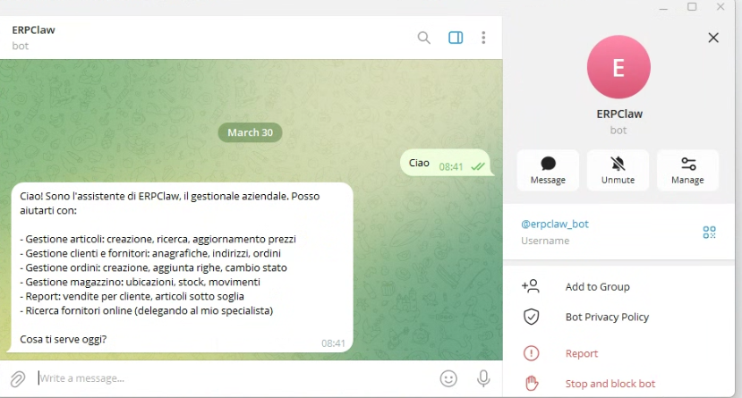
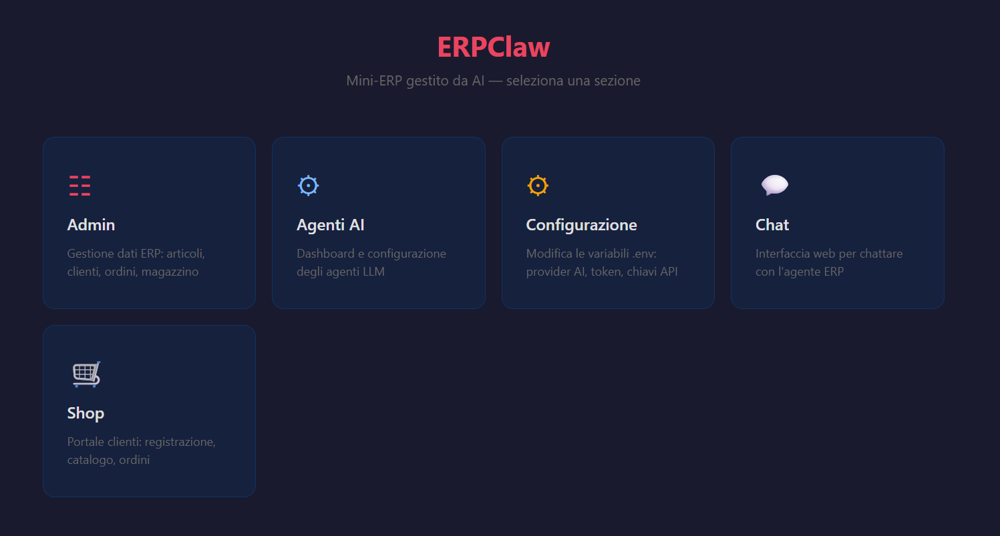
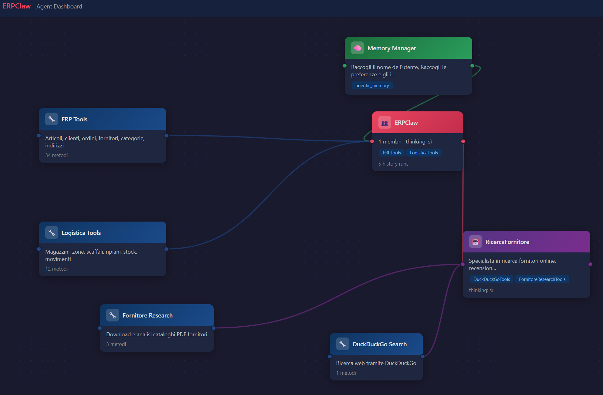
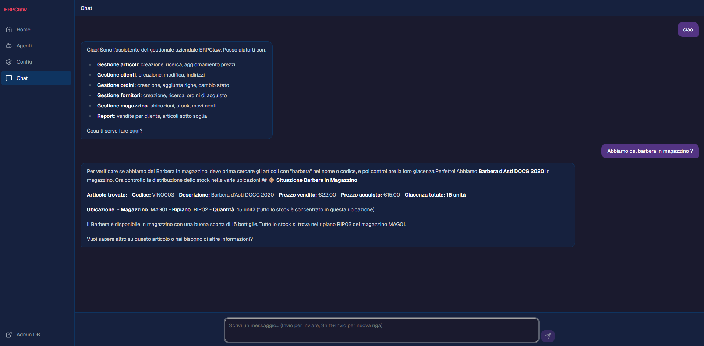

# ERPClaw

Mini-ERP gestito da un agente AI tramite **Telegram**. Scrivi (o parla) in italiano — il sistema capisce e agisce.

---

## Come funziona

L'utente manda un messaggio su Telegram, anche vocale. L'agente AI (LM Studio in locale o DeepSeek cloud, via [agno](https://github.com/agno-agi/agno)) interpreta la richiesta ed esegue le operazioni sul database aziendale SQLite.

```
Telegram → bot.py → agno Team (LM Studio / DeepSeek) → ERPTools        → erp.db
                                                       → LogisticaTools  → erp.db
                                                       ↘ FornitoreResearchAgent → web search / PDF
```



## Funzionalità

- **Magazzino e ubicazioni** — gerarchia fisica Magazzino→Zona→Scaffale→Ripiano; stock per ubicazione
- **Movimenti di magazzino** — carico, scarico, trasferimento con storico completo
- **Integrazione ordini-magazzino** — scarico automatico dalle ubicazioni quando un ordine è spedito (strategia LIFO)
- **Fornitori** — ricerca web, salvataggio anagrafica, indirizzi multi-tipo, download cataloghi PDF
- **Importazione cataloghi** — parsing PDF, ricerca prezzi online, inserimento articoli con margine personalizzabile
- **Clienti** — anagrafica con indirizzi multi-tipo (sede legale, spedizione, fatturazione)
- **Ordini clienti** — creazione, gestione stati (`bozza → confermato → spedito → chiuso`)
- **Ordini fornitori** — creazione e gestione ordini di acquisto (`bozza → inviato → ricevuto`) con prezzo di acquisto per articolo
- **Prezzi duali** — ogni articolo ha `prezzo_vendita` (ai clienti) e `prezzo_acquisto` (dai fornitori)
- **Categorie articoli** — gestite dall'agente AI (`crea_categoria`, `assegna_categoria`, `lista_categorie`)
- **Scorta minima** — soglia per articolo; alert automatico per il riordino (`articoli_sotto_scorta_minima`)
- **Messaggi vocali** — trascrizione automatica via OpenAI Whisper
- **Pannello web** — admin CRUD su browser (FastAPI + SQLAdmin)
- **Portale shop clienti** — i clienti si registrano e ordinano via browser (`/shop`), senza Telegram
- **Dashboard agenti** — visualizzazione e gestione del team AI in stile n8n (`/agents`)
- **Pannello configurazione** — modifica il file `.env` dal browser senza aprirlo (`/config`)
- **Chat web** — interagisce con l'agente AI direttamente dal browser, senza Telegram (`/chat`)
- **Homepage** — menu centrale con accesso rapido a tutte le sezioni (`/`)
- **Memoria** — l'agente ricorda preferenze e contesto per ogni utente Telegram

## Homepage

Menu centrale con accesso rapido a tutte le sezioni del pannello web.



Accessibile su **`http://localhost:5173/`** (dev) o **`http://localhost:8000/`** (produzione)

---

## Dashboard Agenti

Dashboard visuale in stile **n8n** per visualizzare e modificare il team di agenti AI in tempo reale. Costruita con **React + @xyflow/react**.



Accessibile su **`http://localhost:5173/agents`** (dev) o **`http://localhost:8000/agents`** (produzione)

### Caratteristiche

- **Canvas interattivo** — ogni componente (Team, Agenti, Tool, Memory Manager) è un nodo colorato con connessioni animate (@xyflow/react)
- **Drag & drop** — riorganizza i nodi trascinandoli sulla canvas
- **Modifica in tempo reale** — doppio click su un nodo per aprire l'editor laterale (shadcn Sheet)
- **Salvataggio persistente** — la configurazione viene salvata in `agent_config.json` via API PUT
- **Ricarica a caldo** — applica le modifiche senza riavviare il server
- **Minimap** — visualizzazione compatta dell'intera topologia dell'agente

### Nodi visualizzati

| Nodo | Colore | Contenuto |
|------|--------|-----------|
| Team ERPClaw | Rosso | Prompt principale, tools, membri, history |
| Agenti (es. RicercaFornitore) | Viola | Ruolo, instructions, thinking on/off |
| Tool (ERPTools, LogisticaTools, ecc.) | Blu | Descrizione, lista metodi |
| Memory Manager | Verde | Istruzioni di cattura memoria |

## Chat Web

Interfaccia chat integrata nel pannello web per interagire con l'agente AI direttamente dal browser, senza Telegram.



Accessibile su **`http://localhost:5173/chat`** (dev) o **`http://localhost:8000/chat`** (produzione)

---

## Stack tecnico

| Componente | Tecnologia |
|---|---|
| LLM agente | LM Studio (locale) o DeepSeek cloud — configurabile via `.env` |
| Modello consigliato | Qwen3.5-9B (LM Studio) |
| Framework agente | [agno](https://github.com/agno-agi/agno) |
| Trascrizione voce | OpenAI Whisper |
| Database ERP | SQLite + SQLAlchemy |
| Bot Telegram | python-telegram-bot |
| Pannello web + shop | FastAPI + SQLAdmin + HTMX + Bootstrap 5 |
| Frontend SPA (admin) | Vite 6 + React 19 + TypeScript 5 + Tailwind CSS 4 + shadcn/ui + @xyflow/react |
| Package manager | [uv](https://github.com/astral-sh/uv) |
| Python | 3.13 |

## Requisiti

- Python 3.13
- [uv](https://github.com/astral-sh/uv)
- Token bot Telegram
- API key OpenAI (solo per i messaggi vocali)
- **LM Studio** (locale, consigliato) oppure API key DeepSeek (cloud)

## Installazione

```bash
git clone https://github.com/Attilio81/ERPClaw.git
cd ERPClaw

# Crea il file .env
cp .env.example .env   # poi compila le variabili

# Installa le dipendenze
uv sync
```

File `.env` richiesto:
```
TELEGRAM_BOT_TOKEN=...
ALLOWED_CHAT_ID=...          # tuo Telegram numeric user ID
OPENAI_API_KEY=...           # solo per messaggi vocali

# Modello locale (default):
LLM_PROVIDER=lmstudio
LLM_MODEL_ID=qwen/qwen3.5-9b
LMSTUDIO_BASE_URL=http://localhost:1234/v1

# Oppure DeepSeek cloud:
# LLM_PROVIDER=deepseek
# LLM_MODEL_ID=deepseek-reasoner
# DEEPSEEK_API_KEY=...

SHOP_SECRET_KEY=...          # opzionale, default dev value
```

## Avvio

```bash
# Avvia solo il bot Telegram
uv run erpclaw

# Avvia solo il backend FastAPI (admin CRUD + shop + API JSON)
uv run uvicorn erpclaw.web:app --reload
# → Admin:     http://localhost:8000/admin
# → Shop:      http://localhost:8000/shop/register

# Avvia il frontend React in modalità sviluppo (proxy verso FastAPI :8000)
cd frontend && npm install   # solo la prima volta
npm run dev
# → http://localhost:5173
# → Home:      http://localhost:5173/
# → Dashboard: http://localhost:5173/agents
# → Config:    http://localhost:5173/config
# → Chat:      http://localhost:5173/chat

# Avvia tutto insieme (Windows) — bot + backend + frontend React
start.bat

# Azzera e rigenera i database
reset_db.bat
```

> **LM Studio:** avvia il server locale prima di lanciare il bot. Vedi `docs/lmstudio-settings.md` per le impostazioni consigliate.

> **Build produzione:** `cd frontend && npm run build` — scrive in `frontend/dist/`. FastAPI serve automaticamente la SPA su `http://localhost:8000/`.

## Esempi d'uso

### Ricerca fornitore e importazione catalogo

```
Utente: mi cerchi il fornitore monge? ha dei cataloghi?

ERPClaw: Ecco i risultati della ricerca online per Monge & C. S.p.A.
         Sede: Monasterolo di Savigliano (CN) | Fatturato: €512M
         ✅ Catalogo PDF disponibile. Vuoi salvarlo nel database?

Utente: sì salvami questo fornitore

ERPClaw: Fornitore salvato! Codice: MONGE | Sito: https://www.monge.it
         Vuoi che scarichi il catalogo e inserisca i primi articoli?

Utente: sì, scarica il catalogo e inserisci i primi 10 articoli

ERPClaw: Ho trovato 10 articoli. I prezzi non sono nel PDF —
         vuoi che li cerchi sui principali e-commerce italiani?

Utente: sì

ERPClaw: Prezzi trovati su Trovaprezzi, Idealo, Zooplus.
         Inserisco con +20% di margine?

Utente: procedi con opzione 2

ERPClaw: ✅ 10 articoli inseriti nel catalogo con prezzi +20%.
```

### Ordine completo con voce — dalla creazione cliente alla spedizione

Chat reale registrata il 10/03/2026. L'utente usa un messaggio vocale per fare tutto in una volta.

```
Utente: [messaggio vocale 20s]
ERPClaw: 🎤 Trascrizione: "Allora, mi dovresti inserire un ordine per il cliente,
         me lo crei anche, che si chiama Aldo Panero, che abita in Viù Urbino 33,
         e mi metti due pezzi di gamberetti e due pezzi di sfilaccetti."

Utente: Via Urbino 33, Torino

ERPClaw: Perfetto! Ho creato il cliente e l'ordine.
         📋 Cliente: Aldo Panero (ALDO01)
         🛒 Ordine ORD-0001 — bozza
         | GEMON CAT BOCCONI ADULT SALMONE GAMBERETTI 415GR | 2 | €1,56 |
         | MONGE CAT MONOPROTEICO SOLO POLLO 80GR SFILACCETTI | 2 | €2,16 |
         💶 Totale: €3,72
         📍 Indirizzo spedizione aggiunto: Via Urbino 33, 10100 Torino (TO)
         Vuoi confermare l'ordine?

Utente: Confermo

ERPClaw: ✅ Ordine ORD-0001 confermato.
         Vuoi gestire la logistica di magazzino ora?

Utente: Sì, gestiamola, ci sono le qtà?

ERPClaw: Stock disponibile in RIP1 (MAG1 › ZONA1 › SCAFF1):
         GEMON GAMBERETTI: 50 disponibili, 2 richiesti ✅
         MONGE SFILACCETTI: 50 disponibili, 2 richiesti ✅
         Vuoi procedere con la spedizione?

Utente: Sì

ERPClaw: 🚚 Spedizione completata!
         Ordine ORD-0001 → stato: spedito
         Stock scaricato da RIP1: -2 gamberetti, -2 sfilaccetti
         Stock aggiornato: 48 pezzi per ciascuno
         ✅ Flusso completato in 8 passi — ordine pronto per la consegna.
```

## Struttura del progetto

```
erpclaw/
├── agent.py                    # agno Team + sub-agente ricerca fornitori
├── agent_config.py             # gestione configurazione agenti (JSON)
├── agents_dashboard.py         # API JSON agenti (/agents/api/*)
├── config_panel.py             # API JSON configurazione .env (/config/api)
├── chat.py                     # API JSON chat (/chat/api/*)
├── bot.py                      # bot Telegram (testo + voce)
├── web.py                      # FastAPI: admin + shop + SPA catch-all
├── shop.py                     # portale ordini clienti (/shop, HTMX)
├── erp_db.py                   # modelli SQLAlchemy + init DB
├── erp_tools.py                # tool ERP (articoli, categorie, clienti, ordini, indirizzi)
├── logistica_tools.py          # tool logistica (ubicazioni, stock, movimenti)
├── fornitore_research_tools.py # tool ricerca fornitori (PDF, web)
├── config.py                   # caricamento .env (LLM_PROVIDER, LLM_MODEL_ID, ecc.)
└── templates/
    └── shop/                   # template Jinja2 portale shop

frontend/                       # React SPA (Vite + TypeScript + shadcn/ui)
├── src/
│   ├── pages/                  # Home, AgentDashboard, ConfigPanel, Chat
│   ├── components/
│   │   ├── layout/             # Sidebar, TopBar
│   │   ├── agents/             # nodi xyflow + NodeEditSheet + flowUtils
│   │   └── config/             # EnvSection
│   └── lib/                    # types.ts, api.ts
├── package.json
└── vite.config.ts              # proxy /agents /config /chat /admin → :8000

agent_config.json               # configurazione agenti (default incluso nel repo)
tests/                          # suite pytest (SQLite in-memory)
docs/
├── lmstudio-settings.md        # impostazioni consigliate LM Studio
└── superpowers/                # design doc e piani implementativi
esempi di chat/                 # export chat Telegram di esempio
reset_db.bat                    # azzera e rigenera i database
MANUALE_UTENTE.md               # manuale non tecnico per l'utente finale
```

## Database

Tutte le tabelle risiedono in `erp.db` (SQLite):

| Gruppo | Tabelle |
|--------|---------|
| Catalogo | `articoli`, `categorie`, `stock_ubicazioni` |
| Clienti | `clienti`, `indirizzi`, `clienti_auth` |
| Ordini clienti | `ordini`, `righe_ordine` |
| Ordini fornitori | `ordini_fornitori`, `righe_ordini_fornitori` |
| Fornitori | `fornitori`, `cataloghi_fornitori` |
| Magazzino | `magazzini`, `zone`, `scaffali`, `ripiani` |
| Movimenti | `movimenti_magazzino` |

`Articolo.giacenza` è una `column_property` derivata (somma di `StockUbicazione.quantita`).

## Aggiungere nuovi tool ERP

1. Aggiungi un metodo a `ERPTools` in `erp_tools.py` con docstring in italiano
2. Registralo con `self.register(self.nome_metodo)` in `__init__`
3. Il metodo deve restituire una stringa markdown
4. Per parametri numerici che il modello potrebbe passare come int (es. CAP), usa `Union[str, int]`

## Aggiungere nuovi tool logistici

1. Aggiungi un metodo a `LogisticaTools` in `logistica_tools.py` con docstring in italiano
2. Registralo con `self.register(self.nome_metodo)` in `__init__`
3. Aggiungi il tool alle istruzioni del team in `agent.py`

## Test

```bash
uv run --no-sync python -m pytest tests/ -v
```

## Licenza

MIT
