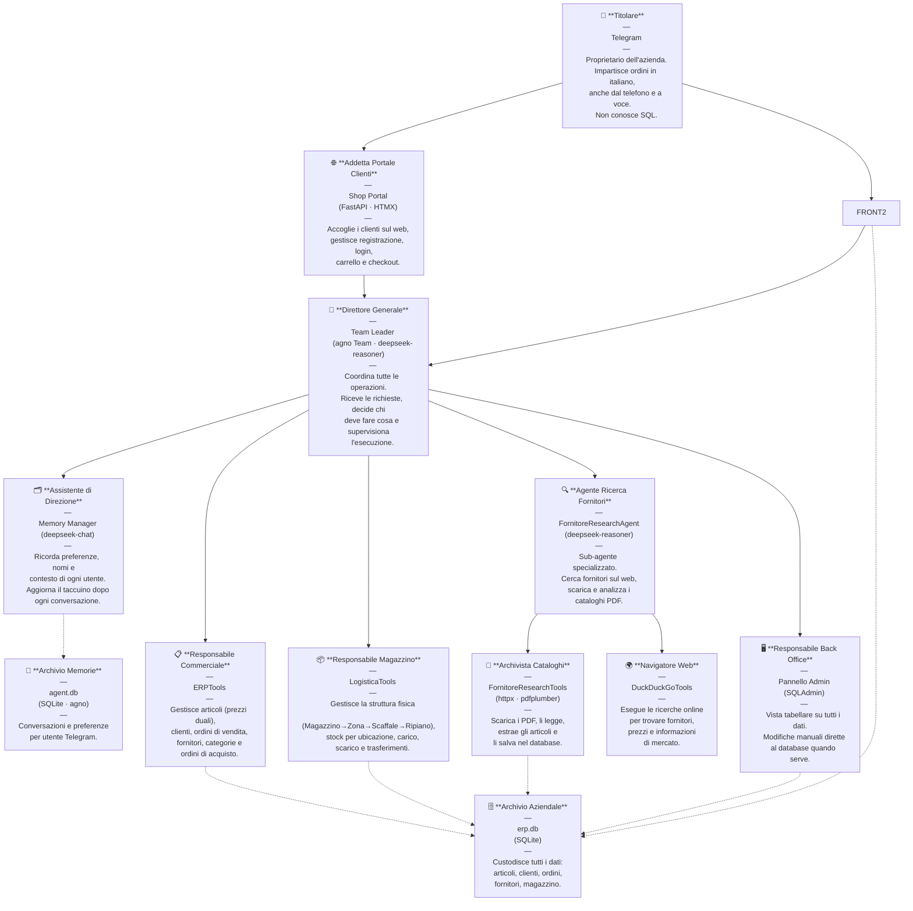

# ERPClaw S.r.l. — Organigramma Aziendale

> *Ogni ruolo è ricoperto da un agente AI. L'azienda non dorme mai, non va in ferie e non chiede aumenti.*

---

## Struttura Organizzativa



---

## Chi fa cosa

| Persona | Ruolo | Strumento |
|---------|-------|-----------|
| 🧠 Direttore Generale | Coordina, delega, risponde all'utente | `agent.py` — agno `Team` |
| 🗂️ Assistente di Direzione | Memoria utenti, preferenze, contesto | `agent.py` — `memory_manager` |
| 📱 Receptionist Telegram | Ingresso messaggi testo e vocali | `bot.py` |
| 🌐 Addetta Portale Clienti | Shop web per ordini clienti autonomi | `shop.py` |
| 🖥️ Responsabile Back Office | Admin CRUD da browser | `web.py` — SQLAdmin |
| 📋 Responsabile Commerciale | Articoli, clienti, ordini, fornitori | `erp_tools.py` — `ERPTools` |
| 📦 Responsabile Magazzino | Ubicazioni, stock, movimenti | `logistica_tools.py` — `LogisticaTools` |
| 🔍 Agente Ricerca Fornitori | Sub-agente web research | `agent.py` — `fornitore_research_agent` |
| 📄 Archivista Cataloghi | Download PDF, parsing, inserimento | `fornitore_research_tools.py` |
| 🌍 Navigatore Web | Ricerche DuckDuckGo | agno `DuckDuckGoTools` |
| 🗄️ Archivio Aziendale | Tutti i dati ERP | `erp.db` |
| 🧠 Archivio Memorie | Storia conversazioni per utente | `agent.db` |

---

## Flusso di una richiesta tipica

```
Utente Telegram
    │
    ▼
📱 Receptionist (bot.py)
    │  trascrisce se vocale (Whisper)
    ▼
🧠 Direttore Generale (Team Leader)
    │  consulta la memoria con l'Assistente
    │
    ├─── operazione commerciale ──▶ 📋 Resp. Commerciale (ERPTools)
    │                                        │
    ├─── operazione magazzino ───▶ 📦 Resp. Magazzino (LogisticaTools)
    │                                        │
    └─── ricerca fornitore ──────▶ 🔍 Agente Ricerca
                                        ├─▶ 🌍 Navigatore Web
                                        └─▶ 📄 Archivista Cataloghi
                                                     │
                                              tutte ──▶ 🗄️ erp.db
```
